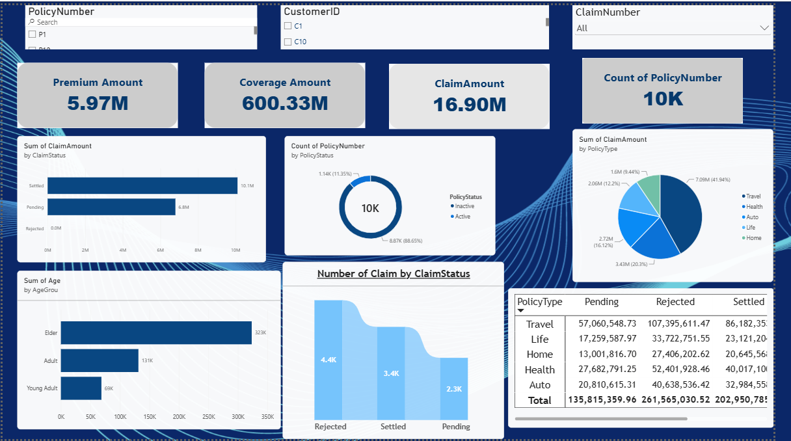

## Dashboard Preview

*Interactive Power BI dashboard showing key insurance metrics, claims analysis, and policy insights.*

# Insurance Analytics Dashboard

## Overview

Interactive Power BI dashboard for analyzing insurance policies, premiums, coverage, claims, and customer information.

## Data

- 10,004 insurance records
- 13 insurance data fields
- Insurance data loaded from CSV/SQL Server

## Data Preparation

Data was prepared using Power Query by:

- Removing duplicate records
- Changing data types
- Handling missing values
- Creating Active/Inactive policy status
- Creating Age Group

## Dashboard Analysis

The dashboard analyzes:

- Premium Amount
- Coverage Amount
- Claim Amount
- Policy Type
- Claim Status
- Age Group
- Gender
- Active and Inactive Policies

Interactive slicers are provided for:

- Policy Number
- Customer ID
- Claim Number

## Drill-Through

A drill-through page provides detailed policy-level information, including:

- Policy Number
- Customer ID
- Claim Number
- Age
- Gender
- Coverage Amount
- Premium Amount
- Policy Dates
- Policy Type
- Claim Status
- Claim Date
- Claim Amount
- Age Group

## Power BI Service

The report was published and managed in Power BI Service.

## Tools

- SQL Server
- Power BI Desktop
- Power Query
- Power BI Services

### Policy Detail Drill-Through

*Detailed policy-level information page for in-depth analysis of individual policies.*
